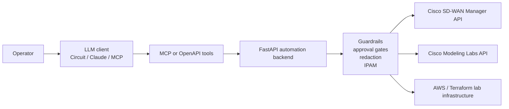

# AI-Assisted SD-WAN Automation PoC

This is the public, lightweight version of a private lab project.

The private lab connects an LLM tool workflow to Cisco Catalyst SD-WAN Manager,
Cisco Modeling Labs, and AWS. This public version keeps the architecture,
workflow, diagrams, and small representative snippets, but intentionally leaves
out lab-specific code, credentials, live URLs, raw configs, and backup data.

Only public product names and generic architecture are described here. Do not
publish internal Cisco documents, customer data, restricted screenshots, live
lab identifiers, private configs, or generated artifacts.

To publish it, copy the contents of this `public_poc/` folder into a separate
GitHub repository. Do not publish the parent private lab directory.

## What This Shows

- How an LLM can operate through MCP/OpenAPI tools instead of guessing from a
  prompt.
- How a FastAPI backend can act as the safety layer between the model and
  network APIs.
- How Cisco SD-WAN Manager, CML, Terraform, AWS, and CI/CD can fit into one
  automation story.
- How to design guardrails for mutation: explicit approval, environment gates,
  IPAM checks, redaction, postchecks, and human-readable reports.

## What The Private Lab Does

In the private lab, one LLM-friendly tool can:

1. Create a Cisco C8000V branch edge in Cisco Modeling Labs.
2. Attach it to simulated INET/MPLS transport links.
3. Prepare SD-WAN onboarding data.
4. Patch day0/bootstrap values.
5. Attach an SD-WAN config group.
6. Poll deployment tasks.
7. Run reachability, control-plane, BFD, alarm, and config-sync postchecks.
8. Return structured facts for the LLM to summarize in plain English.

## Architecture



## Key Idea

The LLM does not directly configure routers.

```text
LLM = chooses tools and writes the human report
MCP/OpenAPI = typed tool contract
FastAPI = validation and execution layer
Network APIs = source of truth
```

That separation keeps the demo practical. The model can be useful without being
trusted with raw shell access or uncontrolled network changes.

## Repository Shape

```text
public_poc/
|-- README.md
|-- .env.example
|-- backend/
|   `-- app.py
|-- mcp_server/
|   `-- sdwan_tools_example.py
|-- terraform/
|   `-- aws-connector-example.tf
|-- .github/
|   `-- workflows/
|       `-- ci.yml
`-- docs/
    |-- architecture.md
    |-- code-highlights.md
    `-- public-release-checklist.md
```

## Example Tool Result

```json
{
  "status": "pass_with_warnings",
  "device": "SITE_520-Edge1",
  "reachability": "reachable",
  "control_connections_up": 3,
  "bfd_sessions": {
    "up": 10,
    "total": 12
  },
  "config_group": "In Sync",
  "blocking_alarms": 0
}
```

The LLM can then explain the result like an operator:

```text
The edge is onboarded and reachable. Control connections are up and the config
group is in sync. Two BFD sessions are still down, so data-plane connectivity
needs a follow-up check, but this is not blocking fabric onboarding.
```

## CI/CD

The private project uses GitHub Actions for:

- mock-mode Python tests
- basic lint feedback
- Terraform formatting and validation
- Dependabot checks for Python, GitHub Actions, and Terraform dependencies

This public version includes a small workflow example showing the same pattern.

## Local Smoke Test

```powershell
python -m venv .venv
. .\.venv\Scripts\Activate.ps1
pip install -r requirements.txt
python -m py_compile backend\app.py mcp_server\sdwan_tools_example.py
uvicorn backend.app:app --host 127.0.0.1 --port 8088
```

## What Is Not Included

- live SD-WAN Manager URL
- CML controller URL
- credentials
- API keys
- Terraform state
- private keys
- raw bootstrap configs
- actual customer or internal documentation
- generated lab backups

## Summary

Built an AI-assisted SD-WAN automation PoC where an LLM uses MCP/OpenAPI tools
to create, onboard, validate, and explain virtual SD-WAN branch edges across
Cisco SD-WAN Manager, CML, Terraform-managed AWS infrastructure, and CI/CD
guardrails.
