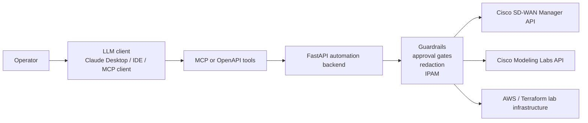
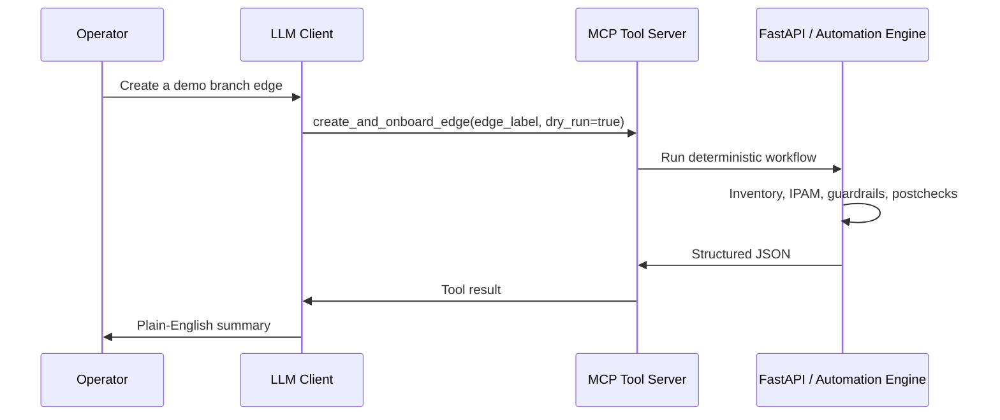

# AI-Assisted SD-WAN Automation PoC

[](https://github.com/folk00/ai-sdwan-mcp-poc/actions/workflows/ci.yml)

This is the public, lightweight proof-of-concept version of a private lab
project.

The private lab connects an LLM tool workflow to Cisco Catalyst SD-WAN Manager,
Cisco Modeling Labs, and AWS. This public version keeps the architecture,
workflow, diagrams, and small representative snippets, but intentionally leaves
out lab-specific code, credentials, live URLs, raw configs, and backup data.

Only public product names and generic architecture are described here. Do not
publish internal Cisco documents, customer data, restricted screenshots, live
lab identifiers, private configs, or generated artifacts.

The private lab code stays private. This repository is the safe public version.

## What This Shows

- How an LLM can operate through MCP/OpenAPI tools instead of guessing from a
  prompt.
- How a FastAPI backend can act as the safety layer between the model and
  network APIs.
- How Cisco SD-WAN Manager, CML, Terraform, AWS, and CI/CD can fit into one
  automation story.
- How to design guardrails for mutation: explicit approval, environment gates,
  IPAM checks, redaction, postchecks, and human-readable reports.

This repo is intentionally small, but it is not only documentation. The sample
code runs a public-safe version of the same flow: inventory -> IPAM -> branch
plan -> approval gate -> postchecks -> LLM-ready JSON.

## What The Private Lab Does

In the private lab, one LLM-friendly tool can:

1. Create a Cisco C8000V branch edge in Cisco Modeling Labs.
2. Attach it to simulated INET/MPLS transport links.
3. Prepare SD-WAN onboarding data.
4. Patch day0/bootstrap values.
5. Attach an SD-WAN config group.
6. Poll deployment tasks.
7. Run reachability, control-plane, BFD, alarm, and config-sync postchecks.
8. Return structured facts for the LLM to summarize in plain English.

## Architecture



## Key Idea

The LLM does not directly configure routers.

```text
LLM = chooses tools and writes the human report
MCP/OpenAPI = typed tool contract
FastAPI = validation and execution layer
Network APIs = source of truth
```

That separation keeps the demo practical. The model can be useful without being
trusted with raw shell access or uncontrolled network changes.

## MCP Flow

MCP is the bridge between the LLM and the automation code. In the private lab,
an MCP-capable client can call tools like:

```text
get_devices
create_and_onboard_edge
diagnose_edge
```

The tool returns structured JSON. The LLM turns that JSON into a readable
operator report.



The public example keeps the same shape but uses sample data instead of live
SD-WAN/CML APIs.

The MCP server is created in [mcp_server/sdwan_tools_example.py](mcp_server/sdwan_tools_example.py):

```python
mcp = FastMCP("sdwan-netops-public-example")

@mcp.tool()
def create_and_onboard_edge(edge_label: str, approve: bool = False, dry_run: bool = True):
    return run_create_edge(edge_label, approve=approve, dry_run=dry_run)
```

Run it with:

```powershell
python mcp_server\sdwan_tools_example.py
```

See [mcp_server/README.md](mcp_server/README.md) and
[mcp_server/mcp_config.example.json](mcp_server/mcp_config.example.json) for
the MCP client configuration example.

## Repository Shape

```text
.
|-- README.md
|-- .env.example
|-- backend/
|   |-- app.py
|   `-- automation_engine.py
|-- mcp_server/
|   |-- README.md
|   |-- mcp_config.example.json
|   |-- sdwan_tools_example.py
|   `-- tool_catalog.py
|-- scripts/
|   |-- install_dev.ps1
|   |-- install_dev.sh
|   |-- register_gitlab_runner_windows.ps1
|   |-- register_gitlab_runner_linux.sh
|   `-- print_tool_catalog.py
|-- tests/
|   `-- test_public_flow.py
|-- terraform/
|   `-- aws-connector-example.tf
|-- .github/
|   `-- workflows/
|       `-- ci.yml
|-- .gitlab-ci.yml
`-- docs/
    |-- architecture.md
    |-- code-highlights.md
    |-- mcp-flow.md
    `-- public-release-checklist.md
```

## Example Tool Result

```json
{
  "status": "pass_with_warnings",
  "device": "SITE_520-Edge1",
  "reachability": "reachable",
  "control_connections_up": 3,
  "bfd_sessions": {
    "up": 10,
    "total": 12
  },
  "config_group": "In Sync",
  "blocking_alarms": 0
}
```

The LLM can then explain the result like an operator:

```text
The edge is onboarded and reachable. Control connections are up and the config
group is in sync. Two BFD sessions are still down, so data-plane connectivity
needs a follow-up check, but this is not blocking fabric onboarding.
```

## CI/CD

This repo uses GitHub Actions, not GitLab CI. The workflow is in:

```text
.github/workflows/ci.yml
```

It currently runs:

- dependency installation
- Python syntax checks
- unit tests for the public-safe automation flow
- MCP tool catalog smoke test
- FastAPI/OpenAPI operation validation
- Terraform formatting and validation
- final pipeline summary

The private lab has a larger CI/CD path, but this public repo keeps the checks
small so they run without Cisco, AWS, VPN, or secrets.

Open the visual pipeline here:

```text
GitHub repo -> Actions -> CI/CD -> latest run
```

The workflow is split into jobs with `needs:` so GitHub draws the graph:

```text
plan -> install -> tests / MCP smoke / OpenAPI smoke
plan -> Terraform validate
all checks -> summary
```

More detail: [docs/cicd-flow.md](docs/cicd-flow.md).

GitLab equivalent:

```text
.gitlab-ci.yml
```

If this repo is mirrored or imported into GitLab, that file creates the same
public-safe pipeline shape: plan, install, tests, MCP smoke, OpenAPI smoke,
Terraform validate, and summary.

Self-hosted GitLab Runner setup is documented in
[docs/gitlab-runner.md](docs/gitlab-runner.md). The repo includes registration
helper scripts, but registration requires a GitLab project runner token.

Private real-lab mode:

```text
GitLab -> Build -> Pipelines -> latest pipeline -> manual lab jobs
```

The GitLab pipeline also includes optional manual jobs for a private lab:

```text
lab_health
lab_edge_dry_run
lab_create_edge
lab_edge_postcheck
```

Those jobs call a private FastAPI automation backend using GitLab CI/CD
variables such as `LAB_API_BASE_URL` and `LAB_API_KEY`. That backend can then
touch CML, SD-WAN Manager, AWS, or Terraform without putting lab URLs or secrets
in the repository. See [docs/lab-cicd-mutations.md](docs/lab-cicd-mutations.md).

## Local Smoke Test

```powershell
python -m venv .venv
. .\.venv\Scripts\Activate.ps1
pip install -r requirements.txt
python -m py_compile backend\app.py mcp_server\sdwan_tools_example.py
python -m unittest discover -s tests -t . -v
python scripts\print_tool_catalog.py
uvicorn backend.app:app --host 127.0.0.1 --port 8088
```

Try the public-safe API:

```powershell
Invoke-RestMethod http://127.0.0.1:8088/api/health
Invoke-RestMethod http://127.0.0.1:8088/api/sdwan/devices

$body = @{ edge_label = "DEMO_AutomationSite"; dry_run = $true } | ConvertTo-Json
Invoke-RestMethod -Method Post `
  -Uri http://127.0.0.1:8088/api/sdwan/onboarding/by-label `
  -ContentType application/json `
  -Body $body
```

OpenAPI docs are available locally at:

```text
http://127.0.0.1:8088/docs
```

Or use the local installer:

```powershell
.\scripts\install_dev.ps1
```

Linux/macOS:

```bash
bash scripts/install_dev.sh
```

## What Is Not Included

- live SD-WAN Manager URL
- CML controller URL
- credentials
- API keys
- Terraform state
- private keys
- raw bootstrap configs
- actual customer or internal documentation
- generated lab backups

## Summary

Built an AI-assisted SD-WAN automation PoC where an LLM uses MCP/OpenAPI tools
to create, onboard, validate, and explain virtual SD-WAN branch edges across
Cisco SD-WAN Manager, CML, Terraform-managed AWS infrastructure, and CI/CD
guardrails.
