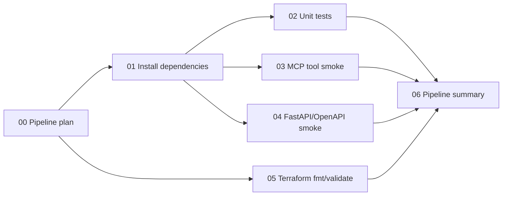

# CI/CD Flow

This repository uses GitHub Actions on GitHub and also includes a GitLab CI
equivalent for portability.

The workflow file is:

```text
.github/workflows/ci.yml
```

The GitLab equivalent is:

```text
.gitlab-ci.yml
```

## What You See In GitHub

Open:

```text
Actions -> CI/CD -> latest run
```

GitHub shows a visual job graph because the workflow uses `needs:` between
jobs.



## Why It Is Split This Way

- `00 - Pipeline plan` writes a short explanation into the run summary.
- `01 - Install dependencies` proves the project can bootstrap.
- `02 - Unit tests` validates the public-safe automation engine.
- `03 - MCP tool smoke` prints the MCP tool catalog and exercises the backing
  workflow.
- `04 - FastAPI/OpenAPI smoke` checks that the LLM-facing operation names exist.
- `05 - Terraform fmt/validate` checks the infrastructure example.
- `06 - Pipeline summary` gives a clean final report.

## Local Installer

Windows:

```powershell
.\scripts\install_dev.ps1
```

Linux/macOS:

```bash
bash scripts/install_dev.sh
```

## Important Boundary

This public CI/CD does not contact Cisco SD-WAN Manager, CML, AWS, VPNs, or any
private lab. It is safe for a public repository.

The private lab could use a self-hosted runner later, but only in a private
repository with locked-down secrets and approvals.

## GitLab CI View

If the repo is imported into GitLab, open:

```text
Build -> Pipelines -> latest pipeline
```

GitLab shows stages horizontally:

```text
plan -> install -> test -> smoke -> terraform -> summary
```

The jobs are intentionally similar to GitHub Actions so the same story works in
either platform.
