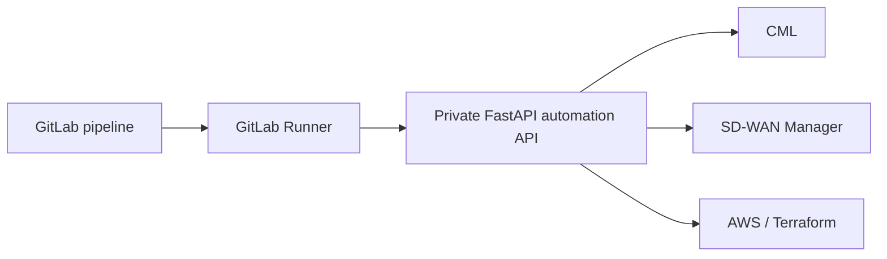

# Real Lab CI/CD Mutations

The default pipeline is public-safe and does not touch any lab.

For a private lab, GitLab can call a private FastAPI automation backend and run
manual jobs that create an edge, onboard it, and run postchecks. The backend is
where CML, SD-WAN Manager, Terraform, and AWS integrations should live.

## Recommended Pattern



The LLM/MCP layer chooses and explains tools. The CI/CD layer proves the same
workflow can be run as a repeatable pipeline.

## Connectivity Options

Use one of these:

- Stable public reverse tunnel to the FastAPI backend.
- Self-hosted GitLab Runner running on a machine that is already inside the
  lab/VPN.

For real network mutations, the self-hosted runner is usually cleaner because
the runner can reach private CML and SD-WAN addresses without exposing them.

## GitLab Variables

Configure these in:

```text
GitLab project -> Settings -> CI/CD -> Variables
```

Required:

```text
LAB_API_BASE_URL=https://your-private-automation-api.example
LAB_API_KEY=your-private-api-key
LAB_MUTATION_APPROVED=true
```

Optional:

```text
LAB_API_KEY_HEADER=x-api-key
LAB_BEARER_TOKEN=
LAB_EDGE_LABEL=GitLab_AutomationSite
LAB_DRY_RUN_APPROVE=false
LAB_API_TIMEOUT=120
LAB_POSTCHECK_ATTEMPTS=10
LAB_POSTCHECK_SLEEP_SECONDS=30
```

Set `LAB_DRY_RUN_APPROVE=true` only when the private backend requires an
explicit approval flag even for non-mutating dry-run calls.

Endpoint overrides if your private API uses different paths:

```text
LAB_HEALTH_ENDPOINT=/api/health
LAB_ONBOARD_ENDPOINT=/api/sdwan/onboarding/by-label
LAB_POSTCHECK_ENDPOINT=/api/sdwan/onboarding/postchecks
```

Never commit these values to the repository.

## Manual Jobs

After pushing to GitLab, open:

```text
Build -> Pipelines -> latest pipeline
```

The normal public-safe jobs run automatically. These real-lab jobs appear as
manual jobs:

```text
lab_health
lab_edge_dry_run
lab_create_edge
lab_edge_postcheck
```

Suggested order:

1. Run `lab_health`.
2. Run `lab_edge_dry_run`.
3. Review `lab-dry-run.json`.
4. Run `lab_create_edge`.
5. Run `lab_edge_postcheck`.

## Double Approval Gate

The apply job is manual and also requires:

```text
LAB_MUTATION_APPROVED=true
```

This prevents accidental mutations from a normal push.

## Artifacts

Each lab job uploads JSON artifacts:

```text
lab-health.json
lab-dry-run.json
lab-apply-result.json
lab-postcheck.json
```

Those artifacts are useful for demos because they show the deterministic facts
that the MCP/LLM layer would summarize.

## Public Repo Boundary

This repository only includes the generic CI/CD bridge. The private automation
backend can contain the real CML/SD-WAN/AWS logic, but credentials, URLs,
device inventory, generated configs, and Terraform state must stay private.
